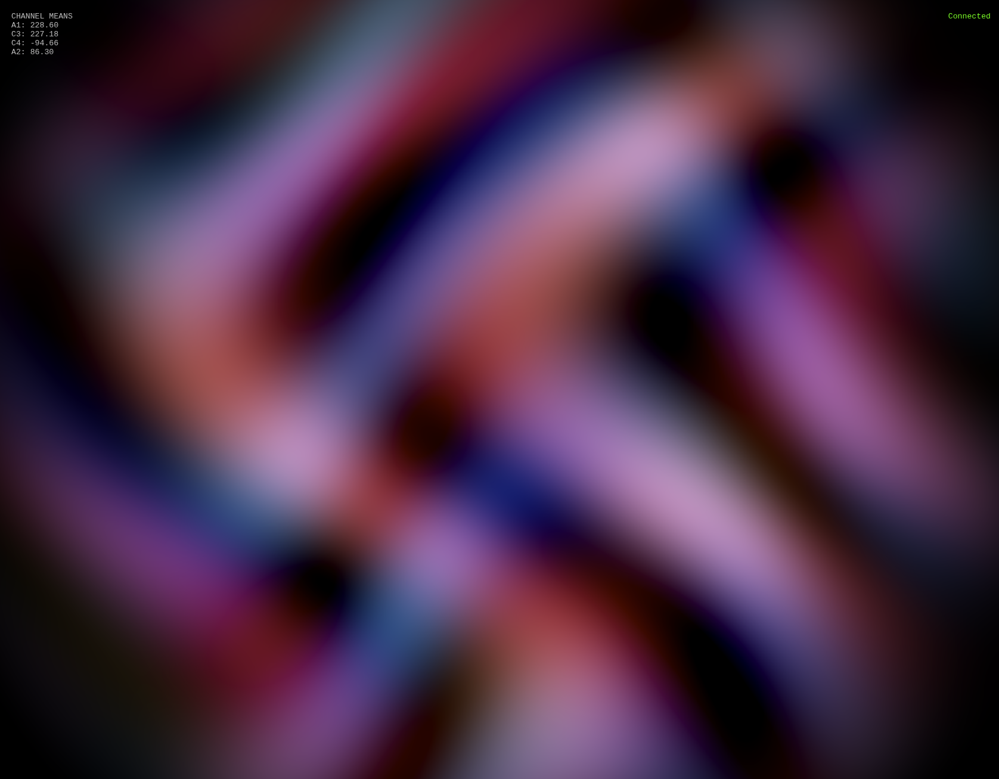
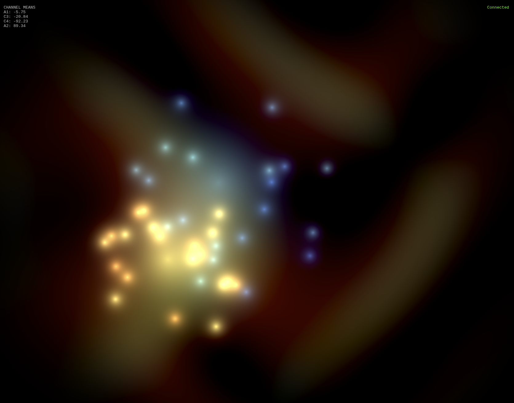
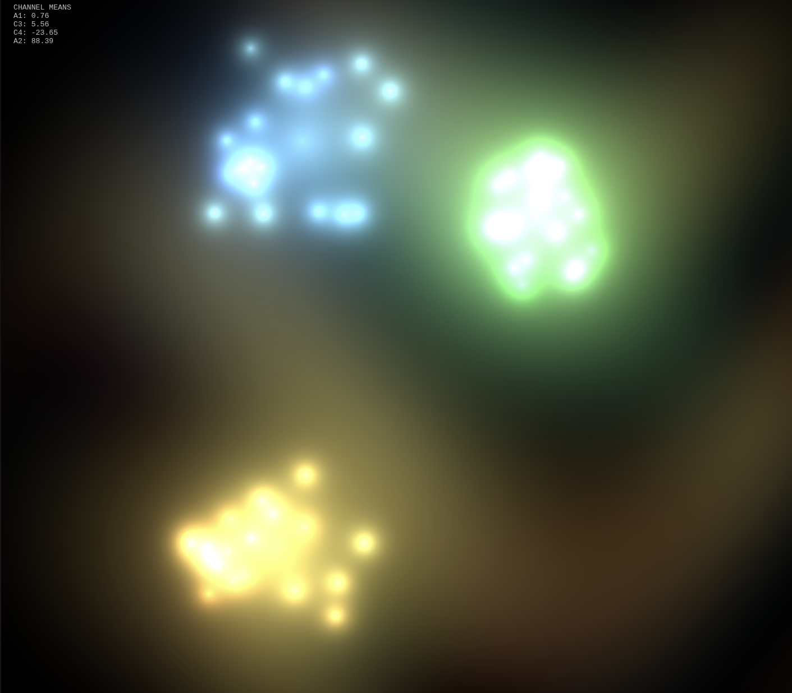
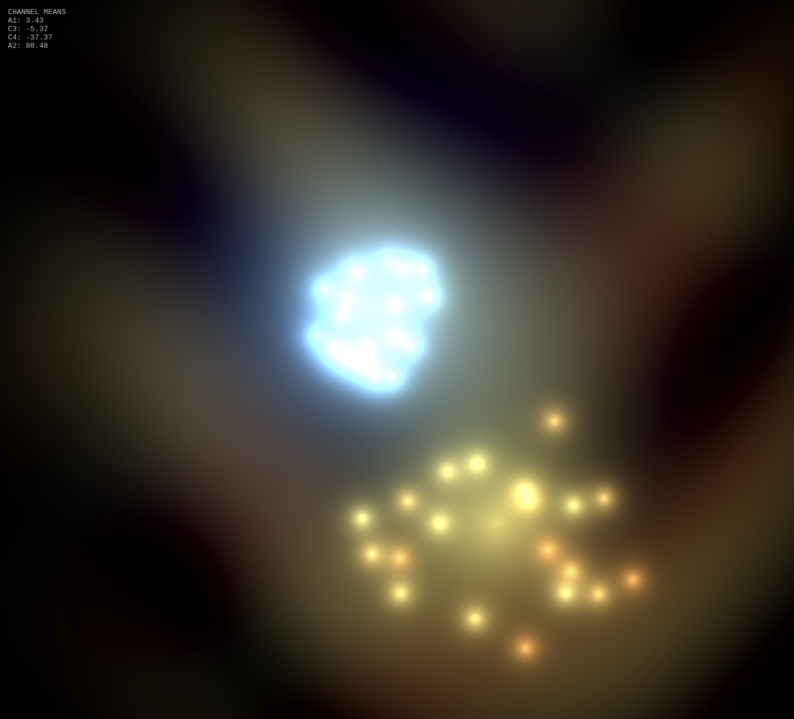

# Enophone Brainwave Visualization

Real-time brainwave visualization using Enophone EEG headphones with BrainFlow SDK.

## Images






## Requirements

- Python 3.8+
- Enophone headphones (optional - can run in simulation mode)
- Bluetooth (for real device)

## Setup

1. Create a virtual environment:
```bash
python -m venv venv
```

2. Activate the virtual environment:
```bash
# Linux/macOS
source venv/bin/activate

# Windows
venv\Scripts\activate
```

3. Install dependencies:
```bash
pip install -r requirements.txt
```

## Quick Start

### Option 1: Visual Art (Recommended)

1. Start the WebSocket server (simulation mode for testing):
```bash
python enophone_websocket_server.py --simulate
```

2. Open `enophone-art.html` in a browser:
   - Drag the file into a browser, OR
   - Run: `python -m http.server 8080` then visit `http://localhost:8080/enophone-art.html`

### Option 2: Real Device

1. Find your Enophone MAC address:
   - Linux: `bluetoothctl devices`
   - Windows: Device Manager → Bluetooth Address

2. Start the server with your MAC:
```bash
python enophone_websocket_server.py --mac XX:XX:XX:XX:XX:XX
```

3. Open `enophone-art.html` in a browser

### Option 3: HTTP API for Grafana

```bash
python enophone_http_server.py --mac XX:XX:XX:XX:XX:XX
# Metrics available at http://localhost:8080/metrics
```

## Channels

Enophone has **4 EEG sensors** positioned at standard 10-20 system locations:

| Channel | Position | Description |
|---------|----------|-------------|
| A1 | Left ear (mastoid) | Reference electrode |
| C3 | Left motor cortex | Left hemisphere brain activity |
| C4 | Right motor cortex | Right hemisphere brain activity |
| A2 | Right ear (mastoid) | Reference electrode |

The sensors capture brainwave data from the frontal parietal lobe (involved in sustained attention) and can detect all 5 brainwave types:
- **Gamma** (40 Hz): Peak focus, high alertness
- **Beta** (13 Hz): Active thinking, concentration
- **Alpha** (10 Hz): Relaxed flow, creative states
- **Theta** (7.83 Hz): Deep relaxation, meditation
- **Delta** (1-4 Hz): Deep sleep

## Scripts

| Script | Description |
|--------|-------------|
| `enophone_websocket_server.py` | WebSocket server for real-time visualization |
| `enophone_http_server.py` | HTTP API for Grafana/polling |
| `enophone_monitor.py` | CLI brainwave monitor |
| `enophone_monitor_gui.py` | GUI visualization with matplotlib |
| `enophone-art.html` | WebGL visual art (browser-based) |

## Usage

### WebSocket Server
```bash
# With simulated data (no hardware needed)
python enophone_websocket_server.py --simulate

# With real device (MAC required on Linux)
python enophone_websocket_server.py --mac XX:XX:XX:XX:XX:XX --port 8765
```

### CLI Monitor
```bash
python enophone_monitor.py --mac XX:XX:XX:XX:XX:XX
```

### GUI Monitor
```bash
python enophone_monitor_gui.py --mac XX:XX:XX:XX:XX:XX --gui
```

## Visual Effects

The WebGL art (`enophone-art.html`) displays:
- **Flow fields**: Color-coded by channel (A1, C3, C4, A2)
- **Calm indicator**: Central ripple effect when all channels near ideal range
- **High spike fireworks**: When values exceed ±1000
- **Low zone fireworks**: When values are between -25 and 25
- **Intensity damping**: Values >1250 are reduced by 50% to prevent saturation

## Troubleshooting

- **Connection refused**: Ensure WebSocket server is running (`python enophone_websocket_server.py --simulate`)
- **No data from device**: Check Bluetooth pairing and MAC address
- **Linux requires MAC**: Unlike Windows/macOS, Linux requires explicit MAC address